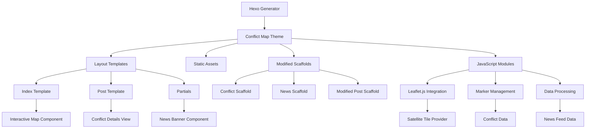

# Design Document: Conflict Map Theme

## Overview

Le thème "Conflict Map" est un thème Hexo personnalisé qui transforme un blog statique en une plateforme interactive de visualisation des conflits mondiaux. Le thème utilise une carte du monde satellite comme interface principale, permettant aux utilisateurs d'explorer géographiquement les conflits en cours à travers des marqueurs interactifs et des articles détaillés.

L'architecture suit les conventions Hexo tout en intégrant des technologies web modernes pour la cartographie interactive et la visualisation de données géospatiales.

## Architecture

### Structure du Thème Hexo

```
themes/conflict-map/
├── _config.yml                 # Configuration du thème
├── layout/
│   ├── layout.ejs             # Template de base
│   ├── index.ejs              # Page d'accueil avec carte
│   ├── post.ejs               # Template pour articles de conflits
│   ├── archive.ejs            # Archive des conflits
│   └── partials/
│       ├── head.ejs           # Métadonnées et CSS
│       ├── header.ejs         # En-tête du site
│       ├── footer.ejs         # Pied de page
│       ├── map.ejs            # Composant carte interactive
│       └── news-banner.ejs    # Bandeau d'actualités
├── source/
│   ├── css/
│   │   ├── main.css           # Styles principaux
│   │   ├── map.css            # Styles spécifiques à la carte
│   │   └── news-banner.css    # Styles du bandeau
│   └── js/
│       ├── map.js             # Logique de la carte interactive
│       ├── markers.js         # Gestion des marqueurs
│       └── news-banner.js     # Animation du bandeau
└── scripts/
    └── helpers.js             # Helpers Hexo personnalisés
```

### Modifications des Scaffolds

```
scaffolds/
├── conflict.md                 # Nouveau scaffold pour posts de conflits
├── news.md                     # Nouveau scaffold pour actualités
├── post.md                     # Scaffold post modifié
└── draft.md                    # Scaffold draft modifié (optionnel)
```

### Architecture Technique



## Components and Interfaces

### 1. Map Component (map.ejs + map.js)

**Responsabilités:**
- Initialisation de la carte Leaflet avec tuiles satellite
- Gestion du zoom et de la navigation
- Rendu responsive pour différentes tailles d'écran

**Interface:**
```javascript
class ConflictMap {
  constructor(containerId, options)
  initializeMap()
  setView(lat, lng, zoom)
  addTileLayer(provider, options)
  resize()
}
```

**Configuration:**
```yaml
# _config.yml
map:
  provider: 'osm'  # osm, mapbox, esri
  access_token: ''  # Requis pour mapbox
  satellite_style: 'satellite'  # satellite ou standard
  default_zoom: 3
  center: [20, 0]  # lat, lng
  max_zoom: 18
  min_zoom: 2
```

### 2. Marker Management (markers.js)

**Responsabilités:**
- Création et positionnement des marqueurs de conflits
- Gestion des clusters pour les zones denses
- Interaction utilisateur (hover, click)

**Interface:**
```javascript
class ConflictMarkers {
  constructor(map, conflicts)
  addMarker(conflict)
  removeMarker(conflictId)
  updateMarker(conflictId, data)
  createCluster(markers)
  bindPopup(marker, content)
}
```

**Structure des données de conflit:**
```javascript
{
  id: 'conflict-ukraine-2024',
  title: 'Conflit en Ukraine',
  coordinates: [50.4501, 30.5234],
  severity: 'high', // low, medium, high, critical
  type: 'war', // war, civil_unrest, terrorism, etc.
  status: 'active', // active, resolved, escalating
  lastUpdate: '2024-01-03',
  summary: 'Description courte du conflit'
}
```

### 3. News Banner Component (news-banner.ejs + news-banner.js)

**Responsabilités:**
- Affichage défilant des dernières actualités
- Animation fluide et contrôles utilisateur
- Intégration avec les données Hexo

**Interface:**
```javascript
class NewsBanner {
  constructor(containerId, newsItems)
  startScrolling()
  pauseScrolling()
  resumeScrolling()
  updateNews(newItems)
}
```

### 4. Conflict Post Template (post.ejs)

**Responsabilités:**
- Affichage détaillé des informations de conflit
- Carte localisée de la zone de conflit
- Métadonnées structurées pour SEO

**Front Matter étendu:**
```yaml
---
title: "Conflit en Ukraine : Situation actuelle"
date: 2024-01-03
categories: [Europe, Guerre]
tags: [Ukraine, Russie, OTAN]
conflict:
  coordinates: [50.4501, 30.5234]
  severity: high
  type: war
  status: active
  region: Europe
  countries: [Ukraine, Russie]
  start_date: 2022-02-24
news_priority: high
---
```

## Data Models

### Configuration du Thème

```yaml
# themes/conflict-map/_config.yml
# Configuration de la carte
map:
  provider: osm  # osm, mapbox, esri
  access_token: ""  # Requis pour mapbox
  satellite_style: "satellite"  # satellite ou standard
  default_zoom: 3
  center: [20, 0]
  clustering: true
  cluster_radius: 50

# Configuration des marqueurs
markers:
  default_icon: "/images/markers/default.png"
  severity_icons:
    low: "/images/markers/low.png"
    medium: "/images/markers/medium.png"
    high: "/images/markers/high.png"
    critical: "/images/markers/critical.png"
  
# Configuration du bandeau d'actualités
news_banner:
  enabled: true
  scroll_speed: 50  # pixels par seconde
  pause_on_hover: true
  max_items: 10
  auto_refresh: false

# Fournisseurs de tuiles satellite
tile_providers:
  osm:
    url: "https://{s}.tile.openstreetmap.org/{z}/{x}/{y}.png"
    attribution: "© OpenStreetMap contributors"
    satellite_url: "https://server.arcgisonline.com/ArcGIS/rest/services/World_Imagery/MapServer/tile/{z}/{y}/{x}"
    satellite_attribution: "© Esri © OpenStreetMap contributors"
  mapbox:
    url: "https://api.mapbox.com/styles/v1/mapbox/satellite-v9/tiles/{z}/{x}/{y}?access_token={accessToken}"
    attribution: "© Mapbox © OpenStreetMap"
  esri:
    url: "https://server.arcgisonline.com/ArcGIS/rest/services/World_Imagery/MapServer/tile/{z}/{y}/{x}"
    attribution: "© Esri"
```

### Modèle de Données des Conflits

```javascript
// Structure générée par Hexo à partir du front matter
const ConflictData = {
  // Métadonnées Hexo standard
  title: String,
  date: Date,
  updated: Date,
  categories: Array,
  tags: Array,
  
  // Données spécifiques aux conflits
  conflict: {
    coordinates: [Number, Number], // [lat, lng]
    severity: Enum['low', 'medium', 'high', 'critical'],
    type: Enum['war', 'civil_unrest', 'terrorism', 'border_dispute'],
    status: Enum['active', 'resolved', 'escalating', 'de_escalating'],
    region: String,
    countries: Array,
    start_date: Date,
    end_date: Date, // optionnel
    casualties: {
      estimated: Number,
      source: String,
      last_updated: Date
    }
  },
  
  // Priorité pour le bandeau d'actualités
  news_priority: Enum['low', 'medium', 'high'],
  
  // Contenu de l'article
  content: String,
  excerpt: String
}
```

### Modèle de Données des Actualités

```javascript
const NewsItem = {
  title: String,
  summary: String,
  date: Date,
  source: String,
  url: String, // lien vers l'article complet
  priority: Enum['low', 'medium', 'high'],
  related_conflicts: Array // IDs des conflits liés
}
```

### Scaffolds Personnalisés

Le thème inclut des scaffolds modifiés pour faciliter la création de posts de conflits avec les métadonnées appropriées.

#### Scaffold pour Posts de Conflits (scaffolds/conflict.md)

```yaml
---
title: {{ title }}
date: {{ date }}
categories: []
tags: []
conflict:
  coordinates: [0, 0]  # [latitude, longitude]
  severity: medium     # low, medium, high, critical
  type: war           # war, civil_unrest, terrorism, border_dispute
  status: active      # active, resolved, escalating, de_escalating
  region: ""          # Europe, Asia, Africa, Americas, Oceania
  countries: []       # Liste des pays impliqués
  start_date: {{ date }}
  casualties:
    estimated: 0
    source: ""
    last_updated: {{ date }}
news_priority: medium  # low, medium, high
---

## Contexte

Décrivez le contexte historique et les causes du conflit.

## Situation Actuelle

Décrivez la situation actuelle du conflit.

## Parties Impliquées

Listez les principales parties impliquées dans le conflit.

## Impact Humanitaire

Décrivez l'impact sur les populations civiles.

## Développements Récents

Listez les développements les plus récents.

## Sources

- Source 1
- Source 2
```

#### Scaffold pour Actualités (scaffolds/news.md)

```yaml
---
title: {{ title }}
date: {{ date }}
categories: [Actualités]
tags: []
news_priority: medium  # low, medium, high
source: ""            # Source de l'information
external_url: ""      # Lien vers l'article complet
related_conflicts: [] # IDs des conflits liés
---

Résumé de l'actualité...
```

#### Scaffold Post Standard Modifié (scaffolds/post.md)

```yaml
---
title: {{ title }}
date: {{ date }}
categories: []
tags: []
# Optionnel : pour les posts liés à des conflits
conflict:
  coordinates: []     # [latitude, longitude] - optionnel
  severity: ""        # low, medium, high, critical - optionnel
  type: ""           # war, civil_unrest, terrorism, border_dispute - optionnel
  status: ""         # active, resolved, escalating, de_escalating - optionnel
  region: ""         # Europe, Asia, Africa, Americas, Oceania - optionnel
  countries: []      # Liste des pays impliqués - optionnel
news_priority: ""    # low, medium, high - optionnel pour apparaître dans le bandeau
---
```

## Correctness Properties

*Une propriété est une caractéristique ou un comportement qui doit être vrai pour toutes les exécutions valides d'un système - essentiellement, une déclaration formelle sur ce que le système devrait faire. Les propriétés servent de pont entre les spécifications lisibles par l'homme et les garanties de correction vérifiables par machine.*

Basé sur l'analyse prework des critères d'acceptation, voici les propriétés de correction testables :

### Property 1: Satellite Tile Layer Configuration
*For any* map configuration with a satellite provider, the tile layer URL should contain satellite imagery endpoints and proper authentication tokens
**Validates: Requirements 1.2**

### Property 2: Map Interaction Responsiveness
*For any* user interaction (zoom, pan) on the map, the map state should update to reflect the new view parameters within acceptable time limits
**Validates: Requirements 1.3**

### Property 3: Responsive Map Layout
*For any* screen size change, the map container should adapt its dimensions while maintaining aspect ratio and functionality
**Validates: Requirements 1.4**

### Property 4: Marker Coordinate Accuracy
*For any* conflict post with valid coordinates, the corresponding map marker should be positioned at the exact geographic location specified in the post metadata
**Validates: Requirements 1.5, 2.1**

### Property 5: Marker Interaction Behavior
*For any* marker on the map, hovering should display tooltip content and clicking should navigate to the correct conflict post URL
**Validates: Requirements 2.2, 2.3**

### Property 6: Marker Visual Differentiation
*For any* two conflicts with different severity levels or types, their corresponding markers should have visually distinct styles (color, icon, size)
**Validates: Requirements 2.4**

### Property 7: Marker Clustering Logic
*For any* set of conflicts within the clustering radius, the map should display a cluster marker instead of individual markers when zoomed out
**Validates: Requirements 2.5**

### Property 8: Post Metadata Extraction
*For any* conflict post with front matter, the theme should correctly extract and store all geographic and conflict-related metadata
**Validates: Requirements 3.1**

### Property 9: Post Content Rendering
*For any* conflict post, the rendered page should contain all required conflict information sections and metadata
**Validates: Requirements 3.2**

### Property 10: Localized Map Integration
*For any* conflict post page, a localized map should be displayed centered on the conflict coordinates with appropriate zoom level
**Validates: Requirements 3.3**

### Property 11: Conflict Categorization
*For any* conflict post with category metadata, the theme should correctly group and display conflicts by type, region, or severity
**Validates: Requirements 3.4**

### Property 12: Data Consistency Across Views
*For any* conflict post update, changes should be reflected consistently across the main map, post page, and any related views
**Validates: Requirements 3.5**

### Property 13: News Item Chronological Ordering
*For any* set of news items, they should be displayed in the banner in reverse chronological order (newest first)
**Validates: Requirements 4.2**

### Property 14: News Item Navigation
*For any* news item in the banner, clicking should navigate to the correct URL (internal post or external source)
**Validates: Requirements 4.3**

### Property 15: News Banner Animation
*For any* news banner with multiple items, automatic scrolling should occur at the configured speed and be pausable on hover
**Validates: Requirements 4.4**

### Property 16: Configuration Application
*For any* theme configuration change, the new settings should be applied to map behavior, marker styles, or banner appearance without code modifications
**Validates: Requirements 5.1, 5.2, 5.3, 5.4**

### Property 17: Keyboard Navigation Support
*For any* keyboard navigation attempt, the map and interface elements should respond appropriately to keyboard inputs for accessibility
**Validates: Requirements 6.2**

### Property 18: Fallback Content Display
*For any* failed resource load (map tiles, images), appropriate fallback content should be displayed to maintain usability
**Validates: Requirements 6.3**

### Property 19: Accessibility Compliance
*For any* theme element, proper ARIA attributes and semantic markup should be present for screen reader compatibility
**Validates: Requirements 6.4**

### Property 20: Touch Interface Support
*For any* mobile device interaction, touch gestures should work correctly for map navigation and interface elements
**Validates: Requirements 6.5**

### Property 21: Hexo Feature Integration
*For any* standard Hexo feature (tags, categories, archives), the theme should support and correctly display these features
**Validates: Requirements 7.2**

### Property 22: Front Matter Processing
*For any* post generation, geographic and conflict data from front matter should be automatically extracted and made available to templates
**Validates: Requirements 7.3**

### Property 23: Static File Optimization
*For any* site build, generated static files should meet performance criteria for file size and loading speed
**Validates: Requirements 7.5**

## Error Handling

### Map Loading Failures
- Fallback to alternative tile providers if primary fails
- Display error message with retry option
- Graceful degradation to static map or text-based navigation

### Data Processing Errors
- Validation of conflict coordinates and metadata
- Handling of malformed front matter
- Default values for missing required fields

### Network Connectivity Issues
- Offline map tiles caching strategy
- Progressive enhancement for limited connectivity
- Fallback content for failed external resources

## Testing Strategy

### Dual Testing Approach
Le thème utilisera une approche de test double combinant tests unitaires et tests basés sur les propriétés :

**Tests Unitaires :**
- Exemples spécifiques de configuration de carte
- Cas limites pour les coordonnées géographiques
- Conditions d'erreur pour les données malformées
- Intégration entre composants

**Tests Basés sur les Propriétés :**
- Propriétés universelles sur tous les types d'entrées
- Couverture complète des entrées par randomisation
- Minimum 100 itérations par test de propriété
- Chaque test référence sa propriété de conception correspondante

**Configuration des Tests de Propriétés :**
- Bibliothèque : fast-check pour JavaScript/TypeScript
- Format de tag : **Feature: conflict-map-theme, Property {number}: {property_text}**
- Tests d'intégration avec Hexo pour la génération de site
- Tests de performance pour le chargement des tuiles et l'interaction

**Générateurs de Test Intelligents :**
- Générateur de coordonnées géographiques valides
- Générateur de métadonnées de conflit cohérentes
- Générateur de configurations de thème valides
- Générateur de données de posts Hexo structurées